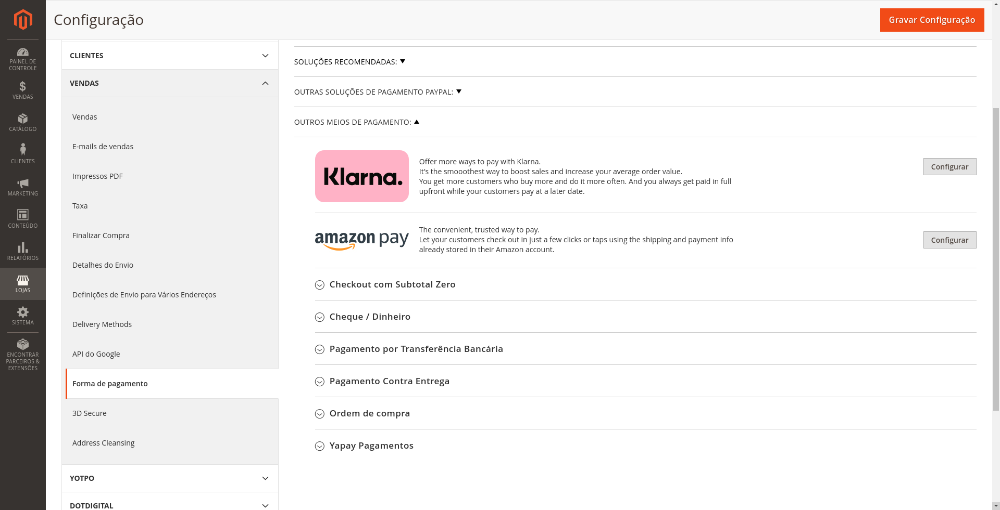

# Módulo de integração [Yapay Intermediador](https://www.yapay.com.br/) 

## Instalação

> Recomendamos que você possua um ambiente de testes para validar as alterações e atualizações antes de atualiar sua loja em produção. Também que seja feito um **backup** com todas as informações antes de executar qualquer procedimento de atualização/instalação.

### Versões Compativeis:

- [x] 2.3.3
- [x] 2.3.4
- [x] 2.3.5
- [x] 2.3.6
- [x] 2.4.0
 
### Pré requisito:

- Requer que o PHP esteja no mínimo na versão 7.1.X.

### Instalação do Módulo Yapay:

- Realize o download do módulo e siga os seguintes passos de acordo com a forma que sua loja foi instalada:

  #### [Yapay-Magento ](https://github.com/tezusecommerce/yapay-magento.git)

### Instalar usando o Composer

1. Instale via packagist 
   - ```composer require tezus/yapay```
       - Neste momento, podem ser solicitadas suas credenciais de autenticação do Magento. Caso tenha alguma dúvida, há uma descrição de como proceder neste [link da documentação oficial](http://devdocs.magento.com/guides/v2.0/install-gde/prereq/connect-auth.html).
2. Execute os comandos:
   - ```bin/magento setup:upgrade```
   - ```bin/magento setup:di:compile```
   - ```bin/magento setup:static-content:deploy -f```
   

   ### Instalar usando o github

- Caso sua loja tenha sido criada por meio do clone ou download do projeto magento, siga os seguintes passos:

  1. Extraia o conteúdo do download ZIP e mova o diretório ```\yapay-magento\``` para dentro da pasta ```Tezus``` e renomeie para ```Yapay```;
  2. Verifique se está dessa maneira seus diretórios na sua loja ```app/code/Tezus/Yapay```
  3. Habilite o módulo com o seguinte comando, ```bin/magento module:enable Tezus_Yapay```
  4. Execute o comando ```bin/magento setup:upgrade```
  5. Execute o comando ```bin/magento setup:di:compile```
  6. Execute o comando ```bin/magento setup:static-content:deploy -f```
  7. Execute o comando ```bin/magento cache:clean```


### Configurações

Acesse no Painel Administrativo do Magento no menu lateral clique em `Lojas`, depois clique em `Configuração`, na sequencia clique em `Clientes`,  `Configurações de Cliente`, e acesse a opção `Opções de Nome e Endereço`. Em `Número de Linhas em Endereço` você deve informar o número 4, conforme imagem abaixo:


Certifique-se também que o campo de telefone esteja obrigatório: 


Após realizar a configuração do Cliente, acesse no Painel Administrativo do Magento No menu lateral clique em `Lojas`, na sequencia clique em `Configuração`, no sub-menu `Vendas` clique em `Formas de Pagamento`. Será carregada a tela para configurar os meios de pagamentos do site. 

<p align="center">
  
</p>

### Como habilitar o Yapay no seu site

No primeiro bloco de informação, está a configuração para habilitar ou desabilitar o módulo por completo, marque `Sim` para continuar a configuração. 

Em seguida temos as configurações gerais, configurações de cartão de crédito, configurações de boleto e configurações de transferência online.

OBS: Para que todas as configurações a seguir funcionem, todo o passo a passo anterior deve ter sido seguido.
	


### Configurações Gerais

- Token
	- Chave de integração da conta Yapay. **OBS: Os tokens de produção e sandbox são distintos.**

- Ambiente
	- Seleciona qual versão de ambiente que o site estará apontando. Os ambientes disponíveis são: ```Desenvolvimento``` e ```Produção```.
	
- Prefixo do pedido
    - Prefixo inserido no campo de pedido enviado para o Yapay, caso opte.
	
- Email
    - O E-mail utilizado na criação da sua conta do Yapay.


### Configurações Cartão de Crédito

- Habilitado
	- Habilita ou desabilita o método de pagamento com cartão de cŕedito.

- Parcelas
    -   Este campo além de trazer a quantidade máxima de parceamento permitida, também já adiciona um percentual de juros em cada parcela caso o cliente opte.

- Bandeiras Disponíveis
	- Seleciona e exibe no formulário de cartão de crédito as bandeiras disponíveis para pagamento.

- Valor mínimo da Parcela
	- Valor mínimo para condição de parcelamento.


<p align="center">
  
</p>


### Configurações de Boleto

- Habilitado
	- Habilita ou desabilita o método de pagamento com boleto.

- Dias de validade do boleto
    - Adiciona a quantidade solicitada de dias para o vencimento do boleto.

- Mensagem ao usuário
	- Mensagem exibida na tela de agradecimento, após finalização do pedido.


### Configurações de Transferência Online

- Habilitado
	- Habilita ou desabilita o método de pagamento com Transferência Online.

- Métodos Disponiveis
  - Habilita os métodos de Transferência Online selecionados.


